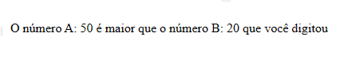

# exerciciosPHP-Parte2
parte 2 dos exercícios para iniciar aprendizado em php. usei o xampp também  

  <h3>Segunda parte dos exercícios para aprender PHP</h3>
  

  

  <h3>Resultados do exercício número 1</h3>
  

  

  <h3>Resultados do exercício número 2</h3>
  

  

  <h3>Resultados do exercício número 3</h3>
  

  

  <h3>Resultados do exercício dos triângulos</h3>
  

  

  <h3>Resultados do exercício do jogo de jokenpo</h3>
  

